# Regression Model Course Project
Rashan Jibowu  
April 24, 2015  

### Executive Summary

This report explores two questions.
1. Is an automatic or manual transmission better for MPG?
2. What is the MPG difference between automatic and manual transmissions?

Using regression analysis and exploratory data analysis, this report details the meaningful difference in miles per gallon between vehicles with automatic and manual transmissions. The final model put forth in this report shows a 4.2 MPG improvement in cars with manual transmissions over those with automatic transmission, holding other factors that contribute to variation in MPG constant.

### Set up

Load the necessary packages and the data


```r
library(datasets)
library(ggplot2)
library(car)
library(corrplot)
data(mtcars)
```

### Exploratory Data Analysis

#### Data summary


```r
summary(mtcars)
```

```
##       mpg             cyl             disp             hp       
##  Min.   :10.40   Min.   :4.000   Min.   : 71.1   Min.   : 52.0  
##  1st Qu.:15.43   1st Qu.:4.000   1st Qu.:120.8   1st Qu.: 96.5  
##  Median :19.20   Median :6.000   Median :196.3   Median :123.0  
##  Mean   :20.09   Mean   :6.188   Mean   :230.7   Mean   :146.7  
##  3rd Qu.:22.80   3rd Qu.:8.000   3rd Qu.:326.0   3rd Qu.:180.0  
##  Max.   :33.90   Max.   :8.000   Max.   :472.0   Max.   :335.0  
##       drat             wt             qsec             vs        
##  Min.   :2.760   Min.   :1.513   Min.   :14.50   Min.   :0.0000  
##  1st Qu.:3.080   1st Qu.:2.581   1st Qu.:16.89   1st Qu.:0.0000  
##  Median :3.695   Median :3.325   Median :17.71   Median :0.0000  
##  Mean   :3.597   Mean   :3.217   Mean   :17.85   Mean   :0.4375  
##  3rd Qu.:3.920   3rd Qu.:3.610   3rd Qu.:18.90   3rd Qu.:1.0000  
##  Max.   :4.930   Max.   :5.424   Max.   :22.90   Max.   :1.0000  
##        am              gear            carb      
##  Min.   :0.0000   Min.   :3.000   Min.   :1.000  
##  1st Qu.:0.0000   1st Qu.:3.000   1st Qu.:2.000  
##  Median :0.0000   Median :4.000   Median :2.000  
##  Mean   :0.4062   Mean   :3.688   Mean   :2.812  
##  3rd Qu.:1.0000   3rd Qu.:4.000   3rd Qu.:4.000  
##  Max.   :1.0000   Max.   :5.000   Max.   :8.000
```

#### Relationships between variables


```r
pairs(mtcars)
```

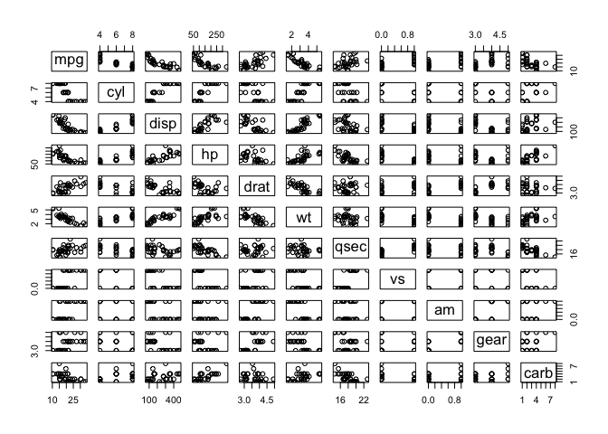 

Taken together, we can see that the variables `cyl`, `vs`, `am`, `gear`, and `carb` take discrete values and may be treated like categorical variables.

#### Transmission versus MPG

Since the core questions center around the relationship between transmission and MPG, below is a plot that examines that relationship more closely.


```r
labels <- c("Automatic", "Manual")
g <- ggplot(aes(y = mpg, x = factor(am, labels = labels), color = factor(am, labels = labels)), data = mtcars)
g <- g + geom_boxplot()
g <- g + ggtitle("MPG vs. Transmission Type") + xlab("Transmission Type") + ylab("Miles per Gallon")
g + theme(legend.position = "none")
```

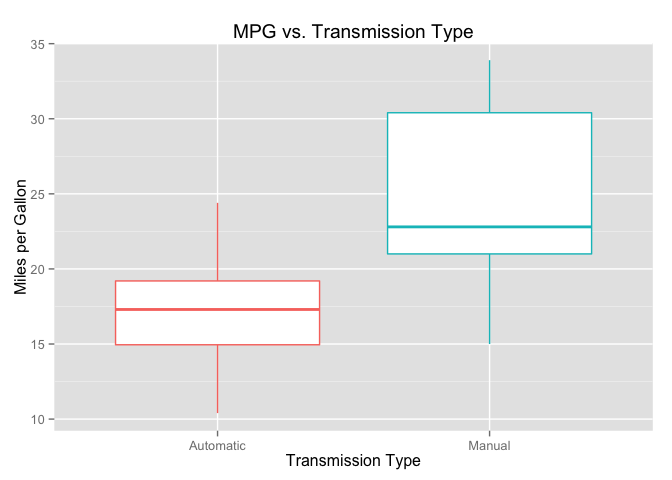 

From the plot above, it is clear that cars with manual transmissions have better MPG than cars with automatic transmissions. 

#### Mean MPG by transmission type

The table below shows the average MPG for cars with each each type of transmission. Again, cars with manual transmissions ave better MPG than those with automatic transmissions.


```r
round(tapply(mtcars$mpg, factor(mtcars$am, labels = labels), mean), 2)
```

```
## Automatic    Manual 
##     17.15     24.39
```

### Regression Analysis

To better understand the relationship between transmission and MPG (in the presence of confounders), three models are put forth to predict miles per gallon for a given car. Each of these models attempts to explain as much of the variance in MPG as possible using only statistically significant variables. 


```r
# Model one
model.1 <- lm(mpg ~ wt + cyl, data = mtcars)
```


```r
# Model two
model.2 <- lm(mpg ~ factor(am) + hp, data = mtcars)
```


```r
# Model three
model.3 <- lm(mpg ~ factor(am) + cyl + carb, data = mtcars)
```

#### Model Selection Methodology

##### Decreasing correlation strategy

One model building strategy is to start with the variable with the highest correlation with `mpg` and subsequently add less correlated variables until additive variables become statistically insignificant (p-values greater than 0.05). To following this strategy, we start with `wt`, whose correlation with `mpg` is the highest (see the Appendix for the correlation matrix). The next highest correlated variable is `cyl`. With just two variables, **this model explains 83% of the variation** in the data without sacrificing significance. 


```r
summary(model.1)
```

```
## 
## Call:
## lm(formula = mpg ~ wt + cyl, data = mtcars)
## 
## Residuals:
##     Min      1Q  Median      3Q     Max 
## -4.2893 -1.5512 -0.4684  1.5743  6.1004 
## 
## Coefficients:
##             Estimate Std. Error t value Pr(>|t|)    
## (Intercept)  39.6863     1.7150  23.141  < 2e-16 ***
## wt           -3.1910     0.7569  -4.216 0.000222 ***
## cyl          -1.5078     0.4147  -3.636 0.001064 ** 
## ---
## Signif. codes:  0 '***' 0.001 '**' 0.01 '*' 0.05 '.' 0.1 ' ' 1
## 
## Residual standard error: 2.568 on 29 degrees of freedom
## Multiple R-squared:  0.8302,	Adjusted R-squared:  0.8185 
## F-statistic: 70.91 on 2 and 29 DF,  p-value: 6.809e-12
```

However, the additive impact of `transmission (am)` is insignificant.


```r
# review additive impact of transmission variable
model.1a <- update(model.1, mpg ~ wt + cyl + factor(am), data = mtcars)
anova(model.1, model.1a)
```

```
## Analysis of Variance Table
## 
## Model 1: mpg ~ wt + cyl
## Model 2: mpg ~ wt + cyl + factor(am)
##   Res.Df    RSS Df Sum of Sq      F Pr(>F)
## 1     29 191.17                           
## 2     28 191.05  1   0.12491 0.0183 0.8933
```

##### Increasing correlation strategy

Another strategy is to start from the least correlated variable and continously add more correlated features. With this strategy, `transmission (am)` and `horsepower (hp)` are the variables with statistical significance.


```r
summary(model.2)
```

```
## 
## Call:
## lm(formula = mpg ~ factor(am) + hp, data = mtcars)
## 
## Residuals:
##     Min      1Q  Median      3Q     Max 
## -4.3843 -2.2642  0.1366  1.6968  5.8657 
## 
## Coefficients:
##              Estimate Std. Error t value Pr(>|t|)    
## (Intercept) 26.584914   1.425094  18.655  < 2e-16 ***
## factor(am)1  5.277085   1.079541   4.888 3.46e-05 ***
## hp          -0.058888   0.007857  -7.495 2.92e-08 ***
## ---
## Signif. codes:  0 '***' 0.001 '**' 0.01 '*' 0.05 '.' 0.1 ' ' 1
## 
## Residual standard error: 2.909 on 29 degrees of freedom
## Multiple R-squared:  0.782,	Adjusted R-squared:  0.767 
## F-statistic: 52.02 on 2 and 29 DF,  p-value: 2.55e-10
```

Although **this model explains 78% of the variance in the data**, a few points less than model 1, it includes the `transmission (am)` predictor that is of primary interest.

**Model Interpretation:** According to Model 2, all else being equal, cars with manual transmissions have approximately 5.3 more miles per gallon than cars with automatic transmissions. 

**Model Uncertainty:** Under Model 2, as shown below, there is 95% confidence that the true improvement in MPG of cars with manual transmission over cars with automatic transmission lies between 3.2 and 7.4 MPG.


```r
am.estimate <- summary(model.2)$coef[2,1]
am.std.error <- summary(model.2)$coef[2,2]

# 95% confidence interval of the estimate
am.estimate + c(-1, 1) * 1.96 * am.std.error
```

```
## [1] 3.161186 7.392985
```

##### Disparate relative correlation strategy

This strategy starts with the predictor of interest `transmission (am)` and selects additional features based on likelihood of explaining significance. Using the correlation matrix (see Appendix), the variable with the _lowest_ correlation with the first predictor and the _greatest_ correlation with the outcome variable `mpg` is identified as a potential model feature. Repeating this process for subsequent features (maximizing the difference between its corellation with all other previously selected predictors) yields a small list of features that is likely to explain much of the variance in the data.


```r
summary(model.3)
```

```
## 
## Call:
## lm(formula = mpg ~ factor(am) + cyl + carb, data = mtcars)
## 
## Residuals:
##     Min      1Q  Median      3Q     Max 
## -5.8853 -1.1581  0.2646  1.4885  5.4843 
## 
## Coefficients:
##             Estimate Std. Error t value Pr(>|t|)    
## (Intercept)  32.1731     2.4914  12.914 2.59e-13 ***
## factor(am)1   4.2430     1.3094   3.240 0.003074 ** 
## cyl          -1.7175     0.4298  -3.996 0.000424 ***
## carb         -1.1304     0.4058  -2.785 0.009481 ** 
## ---
## Signif. codes:  0 '***' 0.001 '**' 0.01 '*' 0.05 '.' 0.1 ' ' 1
## 
## Residual standard error: 2.755 on 28 degrees of freedom
## Multiple R-squared:  0.8113,	Adjusted R-squared:  0.7911 
## F-statistic: 40.13 on 3 and 28 DF,  p-value: 2.855e-10
```

This model explains `81%` of the variation in the data and includes our predictor of interest -- `transmission (am)`.

**Model Interpretation:** According to Model 3, all else being equal, cars with manual transmissions have approximately 4.2 more miles per gallon than cars with automatic transmissions. 

**Model Uncertainty:** Under Model 3, as shown below, there is 95% confidence that the true improvement in MPG of cars with manual transmission over cars with automatic transmission lies between 1.7 and 6.8 MPG.


```r
am.estimate <- summary(model.3)$coef[2,1]
am.std.error <- summary(model.3)$coef[2,2]

# 95% confidence interval of the estimate
am.estimate + c(-1, 1) * 1.96 * am.std.error
```

```
## [1] 1.676529 6.809428
```

### Assessing the models

To select from the three models, we consider the relevance of features, ability to explain variance, and the variance inflation associated with each model.

#### ANOVA Analysis


```r
anova(model.1, model.2, model.3)
```

```
## Analysis of Variance Table
## 
## Model 1: mpg ~ wt + cyl
## Model 2: mpg ~ factor(am) + hp
## Model 3: mpg ~ factor(am) + cyl + carb
##   Res.Df    RSS Df Sum of Sq      F  Pr(>F)  
## 1     29 191.17                              
## 2     29 245.44  0   -54.267                 
## 3     28 212.48  1    32.957 4.3429 0.04641 *
## ---
## Signif. codes:  0 '***' 0.001 '**' 0.01 '*' 0.05 '.' 0.1 ' ' 1
```

At this point, we remove Model 1 from consideration. Despite the fact that it explains more of the variation than the others, it does not include the predictor that we are interested in exploring.

Of the remaining 2 models, Model 3 explains more of the data where `transmission (am)` is a significant factor. The p-value shown in the ANOVA table above indicates that with Model 3, we exchange 1 degree of freedom for additional _meaningful_ explanation of variance. As a result, we are more confident in Model 3's predictive power.

In addition, considering the variance inflation associated with each of the models, Model 3 certainly inflates variance with respect to Model 2, but not nearly as much as Model 1. 

#### Variance Inflation Anaysis


```r
vif(model.1)
```

```
##       wt      cyl 
## 2.579312 2.579312
```

```r
vif(model.2)
```

```
## factor(am)         hp 
##   1.062867   1.062867
```

```r
vif(model.3)
```

```
## factor(am)        cyl       carb 
##   1.743954   2.406509   1.755057
```

As a result, we will continue the analysis by focusing exclusively on Model 3.

#### Model diagnostics

The diagnostic plots below show that model 3 is a quality model.


```r
# diagnostic plots to measure quality of model
plot(model.3)
```

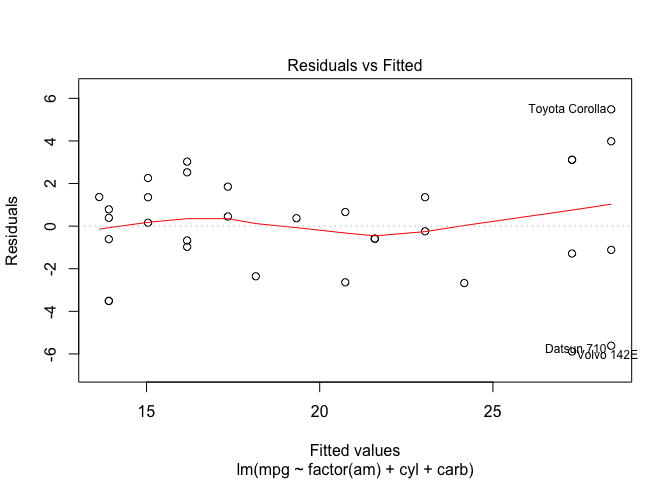 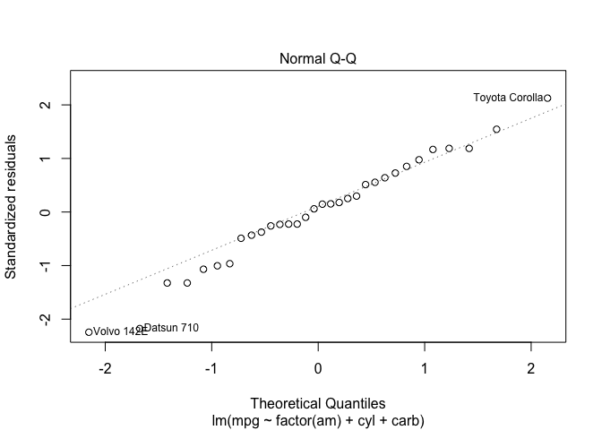 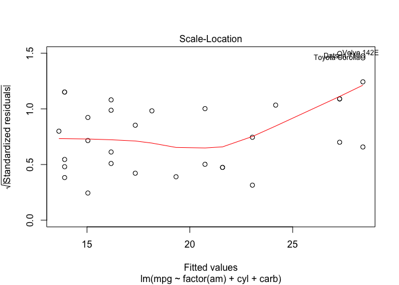 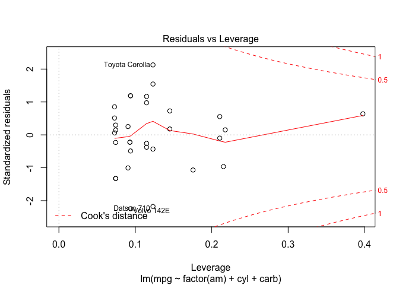 

### Conclusions

Based on the analyses above, *manual transmission is better for MPG*. Based on the final regression model, the estimated improvement in MPG for cars with manual transmissions over cars with automatic transmissions is about 4.2 miles per gallon.

### Appendix

#### Correlaton Matricies

Correlation matricies are helpful in understanding the relationships between variables.


```r
correlation.matrix <- cor(mtcars)
```

A more visual matrix would help the exploratory analysis.


```r
corrplot(correlation.matrix, method = "pie")
```

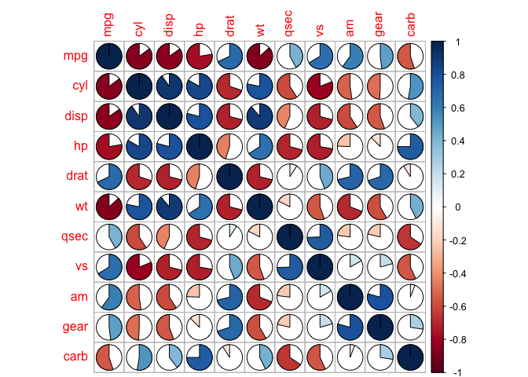 

#### Potential Confounders

Understanding relationships between `mpg` and variables that are highly correlated with it


```r
# plot mpg vs cyl
g <- ggplot(aes(y = mpg, x = factor(cyl), color = factor(am, labels = labels)), 
            data = mtcars) + 
    geom_point()

g + ggtitle("MPG vs. Cylinder Count") + 
    xlab("Cylinder Count") + 
    ylab("Miles per Gallon") + 
    scale_color_discrete(name="Transmission Type")
```

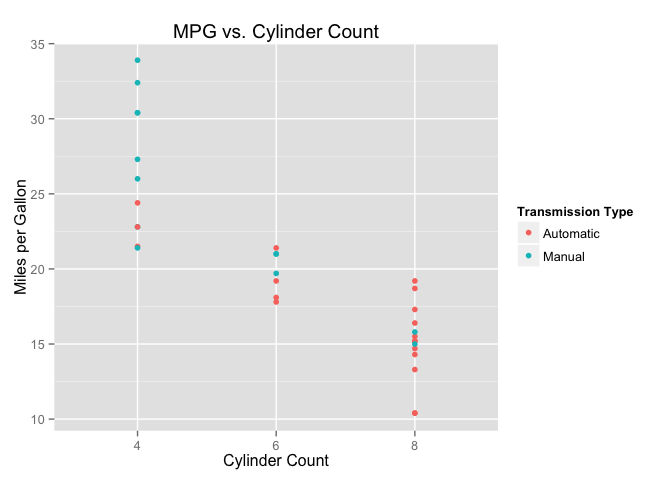 

```r
# plot mpg vg disp
g <- ggplot(aes(y = mpg, x = disp, color = factor(am, labels = labels)), 
            data = mtcars) + 
    geom_point() + 
    geom_smooth(method = "lm")

g + ggtitle("MPG vs. Displacement") + 
    xlab("Displacement (cu.in)") + 
    ylab("Miles per Gallon") +
    scale_color_discrete(name="Transmission Type")
```

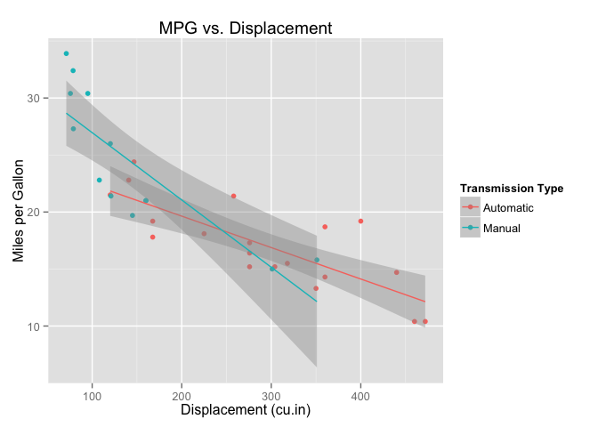 

```r
# plot mpg vs hp
g <- ggplot(aes(y = mpg, x = hp, color = factor(am, labels = labels)), 
       data = mtcars) + 
    geom_point() + 
    geom_smooth(method = "lm")

g + ggtitle("MPG vs. Horsepower") + 
    xlab("Horsepower") + 
    ylab("Miles per Gallon") +
    scale_color_discrete(name="Transmission Type")
```

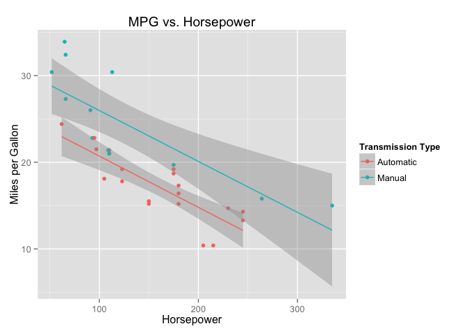 

```r
# plot mpg vs wt
g <- ggplot(aes(y = mpg, x = wt, color = factor(am, labels = labels)), 
            data = mtcars) + 
    geom_point() + 
    geom_smooth(method = "lm")

g + ggtitle("MPG vs. Weight") + 
    xlab("Weight (per 1000 lbs)") + 
    ylab("Miles per Gallon") + 
    scale_color_discrete(name="Transmission Type")
```

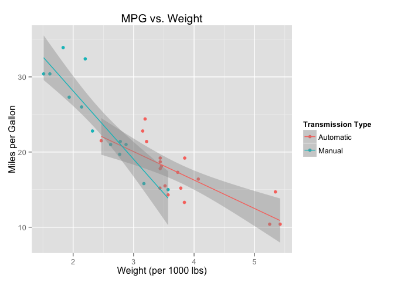 

#### Additional Exploratory Analysis

Understanding relationships between `mpg` and the features of the selected model: `cyl` and `carb`


```r
# plot mpg vs cyl
g <- ggplot(aes(y = mpg, x = factor(cyl), color = factor(am, labels = labels)), 
            data = mtcars) + 
    geom_point()

g + ggtitle("MPG vs. Cylinder Count") + 
    xlab("Cylinder Count") + 
    ylab("Miles per Gallon") + 
    scale_color_discrete(name="Transmission Type")
```

 

```r
# plot mpg vs carb
g <- ggplot(aes(y = mpg, x = factor(carb), color = factor(am, labels = labels)), 
            data = mtcars) + 
    geom_point()

g + ggtitle("MPG vs. Carburetor Count") + 
    xlab("Carburetor Count") + 
    ylab("Miles per Gallon") + 
    scale_color_discrete(name="Transmission Type")
```

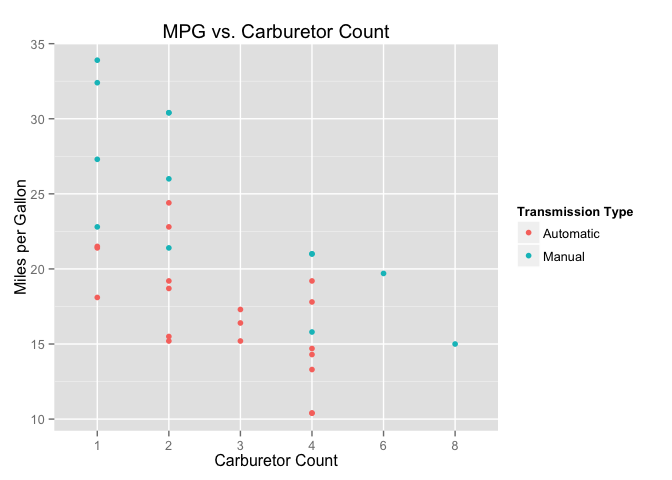 

#### Potential influencers on the model


```r
influence.measures(model.3)
```

```
## Influence measures of
## 	 lm(formula = mpg ~ factor(am) + cyl + carb, data = mtcars) :
## 
##                       dfb.1_ dfb.f..1  dfb.cyl dfb.carb   dffit cov.r
## Mazda RX4            0.01783 -0.04239 -0.00932 -0.01493 -0.0707 1.266
## Mazda RX4 Wag        0.01783 -0.04239 -0.00932 -0.01493 -0.0707 1.266
## Datsun 710          -0.14132 -0.45713 -0.04357  0.43414 -0.8788 0.628
## Hornet 4 Drive       0.02743 -0.02325  0.00511 -0.04135  0.0781 1.260
## Hornet Sportabout   -0.13197  0.04781  0.24361 -0.22369  0.3507 1.138
## Valiant             -0.11117  0.09421 -0.02069  0.16755 -0.3166 1.098
## Duster 360          -0.00414 -0.01335  0.00635  0.01176  0.0408 1.245
## Merc 240D            0.27020 -0.22221 -0.23964  0.11859  0.2828 1.402
## Merc 230            -0.04798  0.03946  0.04255 -0.02106 -0.0502 1.463
## Merc 280             0.19911 -0.22825 -0.21033  0.22065  0.2972 1.253
## Merc 280C            0.04827 -0.05533 -0.05099  0.05349  0.0721 1.347
## Merc 450SE          -0.04069 -0.01129  0.07283 -0.03604  0.1415 1.201
## Merc 450SL          -0.06823 -0.01893  0.12212 -0.06043  0.2373 1.123
## Merc 450SLC         -0.00471 -0.00131  0.00843 -0.00417  0.0164 1.247
## Cadillac Fleetwood   0.03869  0.12459 -0.05927 -0.10978 -0.3805 0.964
## Lincoln Continental  0.03869  0.12459 -0.05927 -0.10978 -0.3805 0.964
## Chrysler Imperial   -0.00842 -0.02712  0.01290  0.02390  0.0828 1.234
## Fiat 128             0.09555  0.30907  0.02946 -0.29353  0.5942 0.924
## Honda Civic          0.13363  0.14436 -0.09934 -0.03272  0.3849 1.038
## Toyota Corolla       0.13737  0.44435  0.04235 -0.42200  0.8542 0.652
## Toyota Corona       -0.45836  0.34549  0.34496 -0.05319 -0.4943 1.188
## Dodge Challenger     0.03455 -0.01251 -0.06377  0.05856 -0.0918 1.294
## AMC Javelin          0.05003 -0.01812 -0.09235  0.08479 -0.1329 1.280
## Camaro Z28           0.00653  0.02103 -0.01000 -0.01853 -0.0642 1.240
## Pontiac Firebird    -0.15930  0.05771  0.29406 -0.27001  0.4233 1.070
## Fiat X1-9           -0.02568 -0.08306 -0.00792  0.07888 -0.1597 1.284
## Porsche 914-2       -0.05397 -0.05830  0.04012  0.01321 -0.1555 1.233
## Lotus Europa         0.13363  0.14436 -0.09934 -0.03272  0.3849 1.038
## Ford Pantera L       0.39140 -0.42008 -0.38318  0.15211 -0.5049 1.288
## Ferrari Dino         0.00387  0.00802 -0.02582  0.06074  0.0789 1.473
## Maserati Bora       -0.13064  0.09403 -0.02726  0.36633  0.5141 1.811
## Volvo 142E          -0.27171 -0.29352  0.20198  0.06652 -0.7826 0.577
##                       cook.d    hat inf
## Mazda RX4           1.29e-03 0.0929    
## Mazda RX4 Wag       1.29e-03 0.0929    
## Datsun 710          1.66e-01 0.1231    
## Hornet 4 Drive      1.58e-03 0.0904    
## Hornet Sportabout   3.08e-02 0.1147    
## Valiant             2.51e-02 0.0904    
## Duster 360          4.30e-04 0.0742    
## Merc 240D           2.05e-02 0.2105    
## Merc 230            6.54e-04 0.2105   *
## Merc 280            2.25e-02 0.1451    
## Merc 280C           1.34e-03 0.1451    
## Merc 450SE          5.14e-03 0.0728    
## Merc 450SL          1.42e-02 0.0728    
## Merc 450SLC         6.96e-05 0.0728    
## Cadillac Fleetwood  3.52e-02 0.0742    
## Lincoln Continental 3.52e-02 0.0742    
## Chrysler Imperial   1.77e-03 0.0742    
## Fiat 128            8.37e-02 0.1231    
## Honda Civic         3.65e-02 0.0937    
## Toyota Corolla      1.59e-01 0.1231    
## Toyota Corona       6.08e-02 0.1755    
## Dodge Challenger    2.18e-03 0.1147    
## AMC Javelin         4.56e-03 0.1147    
## Camaro Z28          1.07e-03 0.0742    
## Pontiac Firebird    4.42e-02 0.1147    
## Fiat X1-9           6.57e-03 0.1231    
## Porsche 914-2       6.21e-03 0.0937    
## Lotus Europa        3.65e-02 0.0937    
## Ford Pantera L      6.39e-02 0.2154    
## Ferrari Dino        1.61e-03 0.2177   *
## Maserati Bora       6.75e-02 0.3978   *
## Volvo 142E          1.30e-01 0.0937
```
